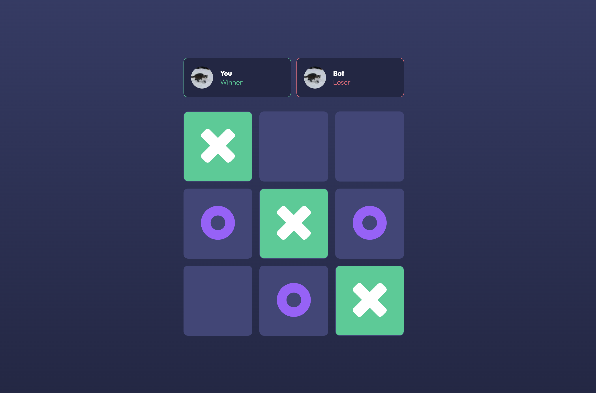

<div id="top"></div>


<!-- PROJECT LOGO -->
<br />
<div align="center">
  <a href="https://github.com/othneildrew/Best-README-Template">
    <h1>Tic-Tac-Toe</h1>
  </a>

<h3 align="center">Javascript/React showcase</h3>

  <p align="center">
    <a href="https://tic-tac-toe-asher.vercel.app">Play the Game</a>
    ·
    <a href="https://github.com/asherstoppard/tic-tac-toe-coding-example/issues/new/choose">Report Bug</a>
    ·
    <a href="https://github.com/asherstoppard/tic-tac-toe-coding-example/projects?type=beta">View Backlog</a>
  </p>
</div>


<!-- TABLE OF CONTENTS -->
<details>
  <summary>Table of Contents</summary>
  <ol>
    <li>
      <a href="#about-the-project">About The Project</a>
      <ul>
        <li><a href="#built-with">Built With</a></li>
      </ul>
    </li>
    <li>
      <a href="#getting-started">Getting Started</a>
      <ul>
        <li><a href="#prerequisites">Prerequisites</a></li>
        <li><a href="#installation">Installation</a></li>
      </ul>
    </li>
    <li><a href="#usage">Usage</a></li>
    <li><a href="#roadmap">Roadmap</a></li>
    <li><a href="#contributing">Contributing</a></li>
    <li><a href="#license">License</a></li>
    <li><a href="#contact">Contact</a></li>
    <li><a href="#acknowledgments">Acknowledgments</a></li>
  </ol>
</details>


## About The Project



An SSR React application containing a simple game of Tic-Tac-Toe, used to showcase my preferred approach to applications and to serve as an example where other proprietary code examples can't be used.

<p align="right">(<a href="#top">back to top</a>)</p>


### Built With

This section should list any major frameworks/libraries used to bootstrap your project. Leave any add-ons/plugins for the acknowledgements section. Here are a few examples.

* [NodeJS](https://nodejs.org)
* [Next](https://nextjs.org/)
* [React](https://reactjs.org/)

<p align="right">(<a href="#top">back to top</a>)</p>


## Getting Started

### Prerequisites

The following technologies are required to run this repository. Please note that `yarn` is preferred as `turborepo` with yarn workspaces is currently on the roadmap and currently `yarn.lock` files are used to shrinkwrap dependencies.

**NodeJS**

Download the latest LTS from [https://nodejs.org/](https://nodejs.org/).

**yarn**

```bash
npm i yarn -g
```

### Clone the repository

```bash
$ git clone git@github.com:asherstoppard/tic-tac-toe-coding-example.git
$ cd tic-tac-toe-coding-example
```

### Install Dependencies

```bash
$ yarn
```


<!-- USAGE EXAMPLES -->
## Usage

**Development**

All the required configuration is packaged. To run the development server simply run:

```bash
$ yarn dev
```

The application will be served at [http://localhost:3000](http://localhost:3000).

> **Please note:** NextJS will serve the application on a different port if 3000 is unavailable. Please check the CLI output for more information.
 
**Testing**

Unit testing is implemented using Jest and React-Testing-Library. To run the tests simply run:

```bash
$ yarn test
```

<p align="right">(<a href="#top">back to top</a>)</p>


<!-- CONTRIBUTING -->
## Contributing

Contributions are what make the open source community such an amazing place to learn, inspire, and create. Any contributions you make are **greatly appreciated**.

If you have a suggestion that would make this better, please fork the repo and create a pull request. You can also simply open an issue with the tag "enhancement".

1. Fork the Project
2. Create your Feature Branch (`git checkout -b feature/feature-name`)
3. Commit your Changes (`git commit -m 'feat(my-feature): add a feature'`)
4. Push to the Branch (`git push origin feature/feature-name`)
5. Open a Pull Request

<p align="right">(<a href="#top">back to top</a>)</p>


<!-- LICENSE -->
## License

Distributed under the MIT License. See `LICENSE.md` for more information.

<p align="right">(<a href="#top">back to top</a>)</p>

<!-- CONTACT -->
## Contact

Asher Stoppard  
[www.asherstoppard.com](https://www.asherstoppard.com/)  
asher@asherstoppard.com

<p align="right">(<a href="#top">back to top</a>)</p>


<!-- MARKDOWN LINKS & IMAGES -->
<!-- https://www.markdownguide.org/basic-syntax/#reference-style-links -->
[contributors-shield]: https://img.shields.io/github/contributors/othneildrew/Best-README-Template.svg?style=for-the-badge
[contributors-url]: https://github.com/othneildrew/Best-README-Template/graphs/contributors
[forks-shield]: https://img.shields.io/github/forks/othneildrew/Best-README-Template.svg?style=for-the-badge
[forks-url]: https://github.com/othneildrew/Best-README-Template/network/members
[stars-shield]: https://img.shields.io/github/stars/othneildrew/Best-README-Template.svg?style=for-the-badge
[stars-url]: https://github.com/othneildrew/Best-README-Template/stargazers
[issues-shield]: https://img.shields.io/github/issues/othneildrew/Best-README-Template.svg?style=for-the-badge
[issues-url]: https://github.com/othneildrew/Best-README-Template/issues
[license-shield]: https://img.shields.io/github/license/othneildrew/Best-README-Template.svg?style=for-the-badge
[license-url]: https://github.com/othneildrew/Best-README-Template/blob/master/LICENSE.txt
[linkedin-shield]: https://img.shields.io/badge/-LinkedIn-black.svg?style=for-the-badge&logo=linkedin&colorB=555
[linkedin-url]: https://linkedin.com/in/othneildrew
[product-screenshot]: images/screenshot.png
